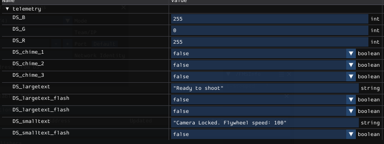

# A Pygame based dashboard for FRC.

# Getting started

 

 1. Open the script and set ip address of the roboRIO.    `ntinst.setServer("127.0.0.1") # Set the server to the simulated robot's IP (127.0.0.1)` 
 2. [Install robotpy](https://docs.wpilib.org/en/stable/docs/zero-to-robot/step-2/python-setup.html)
 3. install pygame by `pip install pygame`

### NetworkTable Control Summary for the FRC Dashboard

The dashboard interacts with various elements using `NetworkTables`. Here’s a detailed summary of how different data points and controls are managed through `NetworkTables`:

----------

### 1. **Canvas Color Control**

-   **Variables**: `DS_R`, `DS_G`, `DS_B`
-   **Table**: `telemetry`
-   **Description**: These three integer variables control the color of the main canvas. The values represent the red, green, and blue color channels, respectively.
-   **Effect**: The background of the canvas changes dynamically based on these RGB values, adjusting the visual appearance of the dashboard.

----------

### 2. **Text Display Control**

-   **Large Text**:
    -   **Variable**: `DS_largetext` (String)
    -   **Flash Control**: `DS_largetext_flash` (Boolean)
    -   **Table**: `telemetry`
    -   **Description**: This string is displayed as the main large text in the center of the canvas. If `DS_largetext_flash` is `True`, the large text will flash at 0.25-second intervals.
-   **Small Text**:
    -   **Variable**: `DS_smalltext` (String)
    -   **Flash Control**: `DS_smalltext_flash` (Boolean)
    -   **Table**: `telemetry`
    -   **Description**: This string is displayed as a smaller text below the large text. If `DS_smalltext_flash` is `True`, the small text will flash at 0.25-second intervals.
-   **Effect**: Both texts dynamically adjust their font size based on the available canvas space and the length of the text. Flashing is optional and controlled by the respective boolean variables.

----------

### 3. **FMS Status and Edge Color**

-   **Variable**: `FMSControlData` (Integer)
    
-   **Table**: `FMSInfo`
    
-   **Description**: The integer `FMSControlData` controls the color of the edges surrounding the canvas. The value represents the current robot status and whether the robot is connected to the FMS (Field Management System).
    
    -   **Disconnected (`0`)**: Grey
    -   **FMS Attached**:
        -   `48`: Red (Disabled)
        -   `49`: Green (Teleoperated)
        -   `51`: Blue (Autonomous)
        -   `53`: Yellow (Test Mode)
    -   **FMS Not Attached**:
        -   `32`: Red (Disabled)
        -   `33`: Green (Teleoperated)
        -   `35`: Blue (Autonomous)
        -   `37`: Yellow (Test Mode)
-   **Effect**: The edges surrounding the canvas change color based on the value of `FMSControlData`. If the FMS is attached (values `48`, `49`, `51`, `53`), a message "FMS Connected" is displayed at the bottom of the screen.
    

----------

### 4. **Chime Sound Controls**

-   **Chime 1**:
    
    -   **Variable**: `DS_chime_1` (Boolean)
    -   **Table**: `telemetry`
    -   **Description**: Plays `chime1.mp3` once when `DS_chime_1` is set to `True`. The chime plays only once until `DS_chime_1` is reset to `False`, which resets the latch.
-   **Chime 2**:
    
    -   **Variable**: `DS_chime_2` (Boolean)
    -   **Table**: `telemetry`
    -   **Description**: Plays `chime2.mp3` once when `DS_chime_2` is set to `True`. The chime plays only once until `DS_chime_2` is reset to `False`, which resets the latch.
-   **Chime 3 (Looping)**:
    
    -   **Variable**: `DS_chime_3` (Boolean)
    -   **Table**: `telemetry`
    -   **Description**: Loops `chime3.mp3` continuously when `DS_chime_3` is `True`. The chime will keep looping until `DS_chime_3` is set to `False`, which immediately stops the sound.

----------

### 5. **Battery Voltage Monitoring (Optional)**

-   **Variable**: `battVoltage` (Double)
-   **Table**: `telemetry`
-   **Description**: Displays the current battery voltage on the screen. This is useful for monitoring the robot’s power levels during operation.
-   **Effect**: The battery voltage is rendered at the top right of the screen, showing real-time voltage readings.