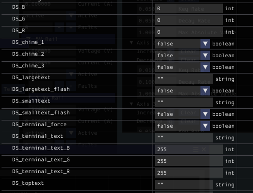

# Maple dash - A Pygame based dashboard for FRC.

Maple-Dash is a minimalist dashboard that only focus on helping drivers on the field. Unlike most other dashboard, Maple Dashboard can not be customized. This design choice help drivers to only focus on the things they must know. 

Part of this code is generated by ChatGPT.

# Features

## Robot Enable status (outer ring)
 
Outer colour ring representing status of the robot. When FMS is connected, a FMS Connected message will also be shown.

* Grey - Disconnected
* Red - Disabled
* Blue - Auto
* Green - Teleop
* Yellow - Test

## Customizable innor colour

RGB values of the inner part of the dashboard could be set though networktables

## Message (Terminal) printout

A terminal alike printout area that can be used to print message for diagnosis. Colour of the printout can be set as well.

## Center text (with flash toggle)

Two line of text that can be custom set. Also when necessary, it can be set to flashing.
The colour of the text can't be custom set as it will always be the invert colour of the background. This ensure the text is always visiable

## Chime sound

Three chime sound playable by toggling three different networktables bool. Chime 1 and 2 will always be played once while chime 3 will loop until nt bool is set to false.

(There is no gif to this as gif don't contain sound. use your imagination or download maple dashboard and try it. This is put here so the post looks uniformity.)

## Config panel

A panel to set target networktable server address and clear message terminal.

## Top text

Text on top can be custom set. Colour will always be invert colour of outer ring. No flashing feature on this top text.

Let's make our drivers' life easier!

# Getting started

 

 1. Open the script and set ip address of the roboRIO.    `ntinst.setServer("127.0.0.1") # Set the server to the simulated robot's IP (127.0.0.1)` 
 2. [Install robotpy](https://docs.wpilib.org/en/stable/docs/zero-to-robot/step-2/python-setup.html)
 3. install pygame by `pip install pygame`

### NetworkTable Control Summary for the FRC Dashboard

The dashboard interacts with various elements using `NetworkTables`. Here’s a detailed summary of how different data points and controls are managed through `NetworkTables`:

----------

### 1. **Canvas Color Control**

-   **Variables**: `DS_R`, `DS_G`, `DS_B`
-   **Table**: `telemetry`
-   **Description**: These three integer variables control the color of the main canvas. The values represent the red, green, and blue color channels, respectively.
-   **Effect**: The background of the canvas changes dynamically based on these RGB values, adjusting the visual appearance of the dashboard.

----------

### 2. **Text Display Control**

-   **Large Text**:
    -   **Variable**: `DS_largetext` (String)
    -   **Flash Control**: `DS_largetext_flash` (Boolean)
    -   **Table**: `telemetry`
    -   **Description**: This string is displayed as the main large text in the center of the canvas. If `DS_largetext_flash` is `True`, the large text will flash at 0.25-second intervals.
-   **Small Text**:
    -   **Variable**: `DS_smalltext` (String)
    -   **Flash Control**: `DS_smalltext_flash` (Boolean)
    -   **Table**: `telemetry`
    -   **Description**: This string is displayed as a smaller text below the large text. If `DS_smalltext_flash` is `True`, the small text will flash at 0.25-second intervals.
-   **Effect**: Both texts dynamically adjust their font size based on the available canvas space and the length of the text. Flashing is optional and controlled by the respective boolean variables.

----------

### 3. **FMS Status and Edge Color**

-   **Variable**: `FMSControlData` (Integer)
    
-   **Table**: `FMSInfo`
    
-   **Description**: The integer `FMSControlData` controls the color of the edges surrounding the canvas. The value represents the current robot status and whether the robot is connected to the FMS (Field Management System).
    
    -   **Disconnected (`0`)**: Grey
    -   **FMS Attached**:
        -   `48`: Red (Disabled)
        -   `49`: Green (Teleoperated)
        -   `51`: Blue (Autonomous)
        -   `53`: Yellow (Test Mode)
    -   **FMS Not Attached**:
        -   `32`: Red (Disabled)
        -   `33`: Green (Teleoperated)
        -   `35`: Blue (Autonomous)
        -   `37`: Yellow (Test Mode)
-   **Effect**: The edges surrounding the canvas change color based on the value of `FMSControlData`. If the FMS is attached (values `48`, `49`, `51`, `53`), a message "FMS Connected" is displayed at the bottom of the screen.
    

----------

### 4. **Chime Sound Controls**

-   **Chime 1**:
    
    -   **Variable**: `DS_chime_1` (Boolean)
    -   **Table**: `telemetry`
    -   **Description**: Plays `chime1.mp3` once when `DS_chime_1` is set to `True`. The chime plays only once until `DS_chime_1` is reset to `False`, which resets the latch.
-   **Chime 2**:
    
    -   **Variable**: `DS_chime_2` (Boolean)
    -   **Table**: `telemetry`
    -   **Description**: Plays `chime2.mp3` once when `DS_chime_2` is set to `True`. The chime plays only once until `DS_chime_2` is reset to `False`, which resets the latch.
-   **Chime 3 (Looping)**:
    
    -   **Variable**: `DS_chime_3` (Boolean)
    -   **Table**: `telemetry`
    -   **Description**: Loops `chime3.mp3` continuously when `DS_chime_3` is `True`. The chime will keep looping until `DS_chime_3` is set to `False`, which immediately stops the sound.

----------

### 5. **Battery Voltage Monitoring (Optional)**

-   **Variable**: `battVoltage` (Double)
-   **Table**: `telemetry`
-   **Description**: Displays the current battery voltage on the screen. This is useful for monitoring the robot’s power levels during operation.
-   **Effect**: The battery voltage is rendered at the top right of the screen, showing real-time voltage readings.

### NetworkTables Summary for Terminal Feature

The **terminal feature** is implemented to display a terminal-like text area in the bottom-left corner of the dashboard. New lines of text are added dynamically, with the option to set custom text colors. The text is printed in a top-to-bottom fashion, and the number of visible lines is limited.

Here’s a summary of how the terminal feature is controlled via NetworkTables:

1. **Data Entries:**
   - **`DS_terminal_text` (string)**: 
     - The string that contains the new line of text to be printed in the terminal.
     - If this value changes, the new text will be printed at the top of the terminal area.

   - **`DS_terminal_text_R`, `DS_terminal_text_G`, `DS_terminal_text_B` (int)**:
     - These entries control the RGB color values of the newly printed line of text.
     - The values are clamped between `0` and `255` to ensure valid RGB values.
     - Older lines retain the colors they were printed with when initially displayed.

   - **`DS_terminal_force` (bool)**:
     - This entry is used to force printing the current `DS_terminal_text`, even if it hasn’t changed since the last print.
     - This acts as a button with latching behavior. When set to `True`, the terminal prints the current text regardless of whether it has changed, and the latch ensures it triggers only once per activation.
     - Once `DS_terminal_force` is reset to `False`, it can be triggered again for subsequent forced prints.

2. **Behavior**:
   - **Normal Text Printing**: The text from `DS_terminal_text` is printed whenever it changes. The most recent line is added to the top of the terminal, and older lines are pushed down.
   - **Forced Printing**: If `DS_terminal_force` is set to `True`, the current text is printed even if it hasn’t changed, allowing the same text to be printed multiple times upon request.
   - **Text Color**: Each new line of text uses the color specified by `DS_terminal_text_R`, `DS_terminal_text_G`, and `DS_terminal_text_B`. The colors for each line are retained even as new lines are added.

3. **Display Area**:
   - The terminal text is displayed in the bottom-left corner of the canvas, within the available screen space and avoiding the edge reserved for the `FMSInfo` data.
   - The number of lines displayed is limited to a pre-set maximum (`terminal_max_lines`), and old lines scroll off the screen as new lines are added.

This allows for dynamic terminal-style text display with customizable color and forced printing features, making it flexible for various dashboard use cases.